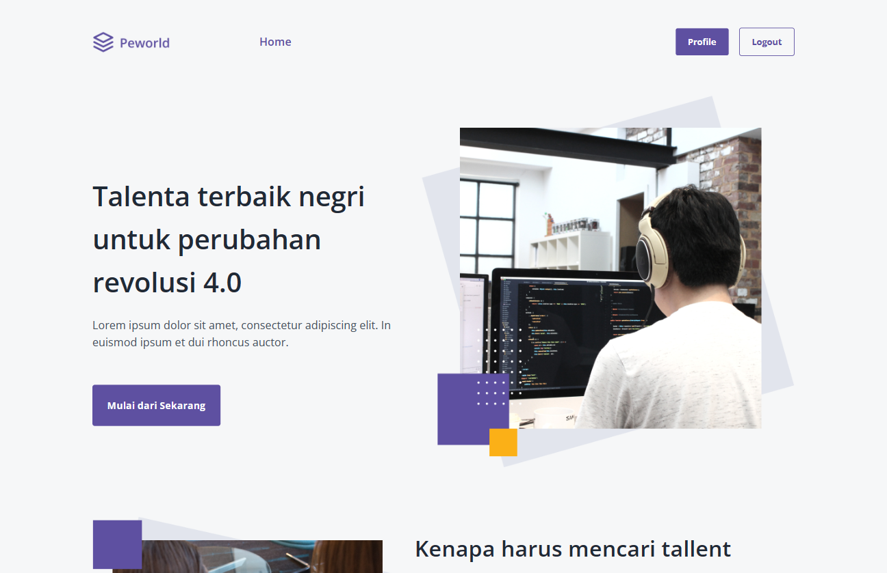
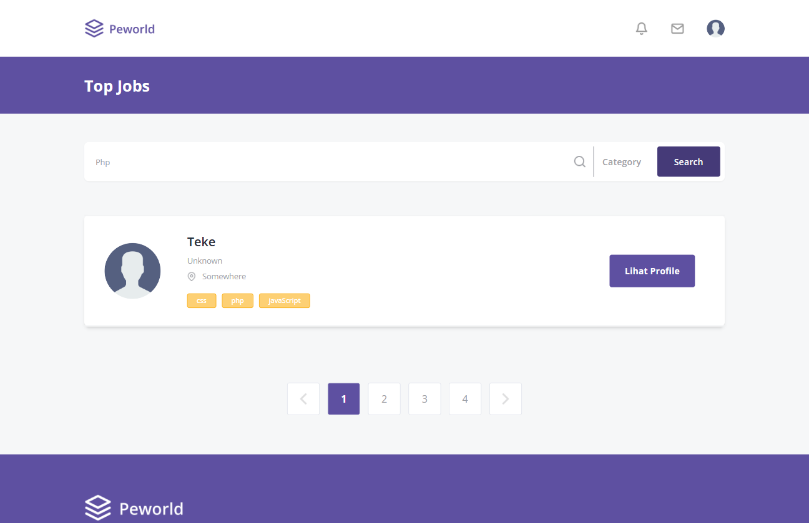

# HireJob implementation based on Figma

> Hire Job is one of the web applications that provides workers for applicants so that it is easy to find the desired worker and company information.

## Usage

This website using Vite + React with Javascript and API using AXIOS library.
I also using React Dom Routes to navigating the pages.

## Documentation

There are 6 pages that I working in progress.

1. Login Page

   

2. Register Page

   Register for Worker
   

   Register for Recruiter
   

3. Landing Page

   Landing Page before Login
   

   Landing Page as Worker
   

   Landing Page as Recruiter
   

4. Home Page

   

   In home page, there are features for search bar.
   

   The features of search bar includes:

   - Search Input to find the skill name.
     

   - Sort Bar - so many options (some of them are work in progress)
     

5. Worker Profile Page

   There are two pages:

   - View Profile
     This page have toolbar to view portofolio and work experience.

   When you're see portofolio:
   

   And when you're see work experience:
   

   This page have different button based on what role you are.

   For example this is worker profile if you're a recruiter
   

   - Edit Profile
     In edit page, there are many section to add, edit, and also delete your biodata, work experience, skill, and portofolio
     

6. Recruiter or Company Profile Page
   This page also have two:

   - View Profile
     

   - Edit Profile
     

7. Hire Page

   This page is to offering job to the selected worker from recruiter.
   

   There also the notification to inform both roles that recruiter offering to worker.

   > Still work in progress.

## Performance

For performance still on development.

## Domain to Visit Pages

If you would like to see my web pages, click the link right below. Thank you so much for your appreciation.

[Click Here](https://react-hirejob-figma-git-main.vercel.app/)

## Reference

[Figma Template](https://www.figma.com/file/ZhfxykSA0qzko0PMs9aPOp/HireJob?type=design&node-id=67-0&mode=design&t=IX8slcJJKTGFdMcm-0)

[React + Vite](https://vitejs.dev/)

[React Dom Router](https://reactrouter.com/en/main)

[Axios](https://axios-http.com/docs/intro)

[Javascript](https://www.w3schools.com/js/)

[HTML](https://www.w3schools.com/html/)

[CSS](https://www.w3schools.com/css/)

[Tailwind](https://tailwindcss.com/)

[Vercel as Deployment](https://vercel.com/)
