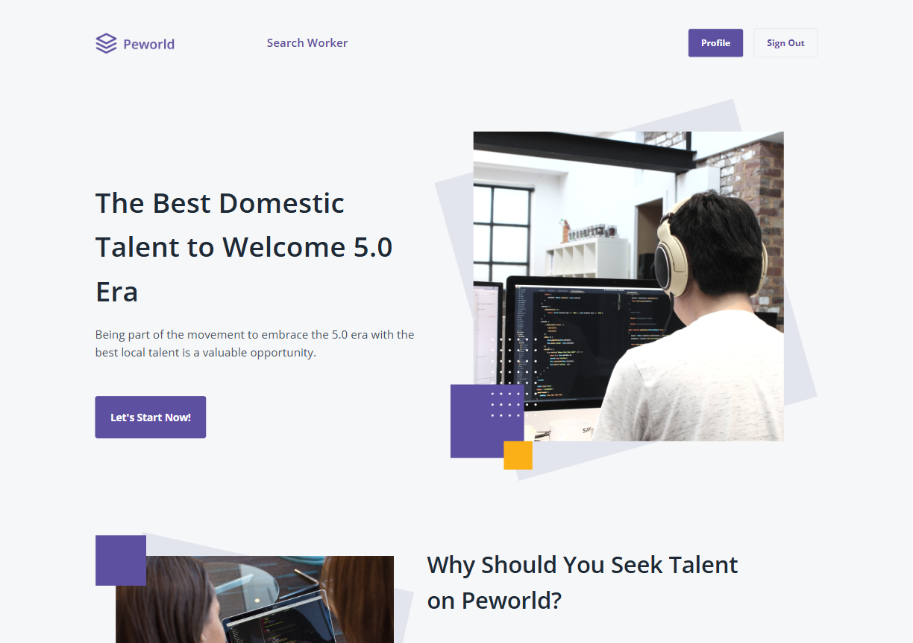
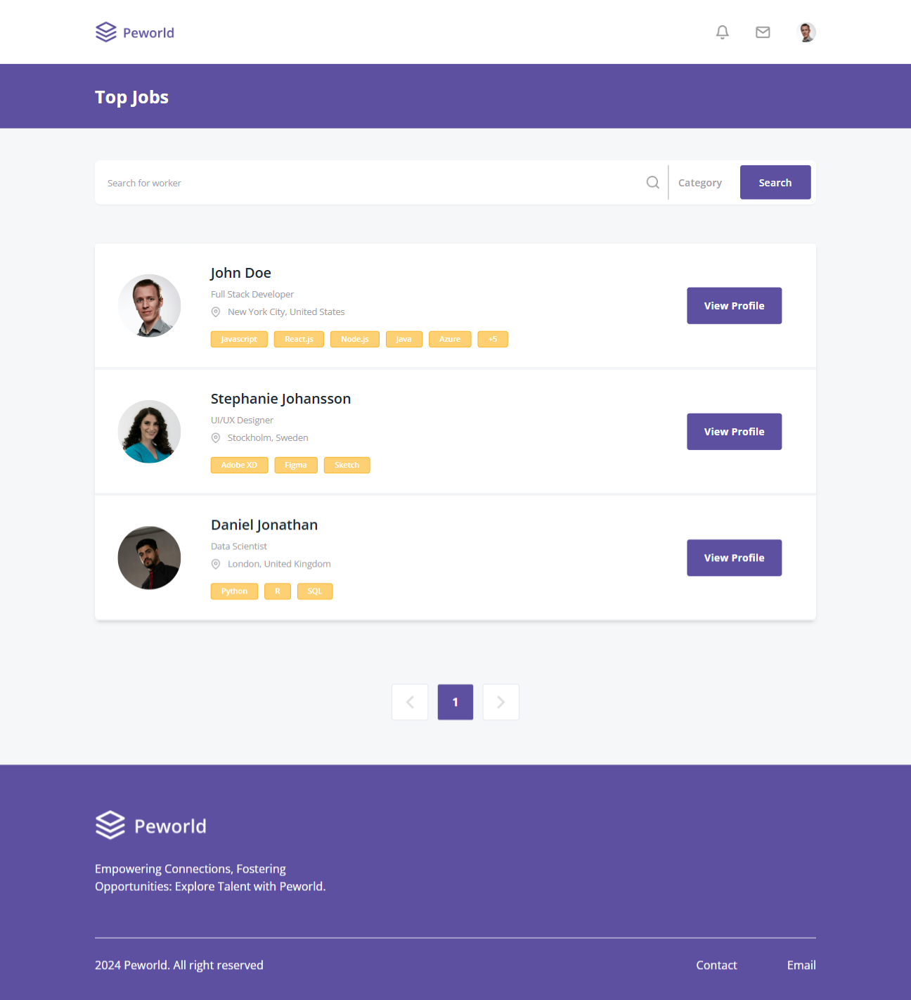
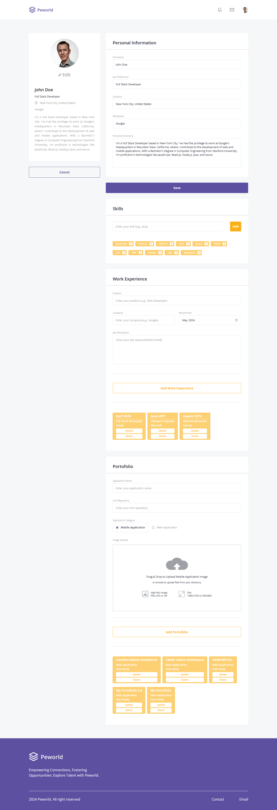

  

# Peworld: Hire Job Implementation Based on Figma

## Table of Contents

- [Table of Contents](#table-of-contents)
- [About The Project](#about-the-project)
- [Usage](#usage)
- [Documentation](#documentation)
- [Performance](#performance)
- [Domain to Visit Pages](#domain-to-visit-pages)
- [Additional Related Resources](#additional-related-resources)
- [Other References](#other-references)

## About The Project

**Peworld** is a dynamic web application designed to revolutionize the job search experience. It not only helps job seekers find suitable employment opportunities but also provides comprehensive and detailed information about potential employers. With **Peworld**, users can explore a wide range of job listings tailored to their skills and preferences, gain insights into company cultures and benefits, and stay updated on the latest industry trends.

## Usage

This website is built from this [Figma template](https://www.figma.com/design/ZhfxykSA0qzko0PMs9aPOp/HireJob?node-id=67-0&t=l9ZG0nyceo9PbVaE-0) using [Vite + React](https://vitejs.dev/) with JavaScript, and the API management is done through the [Axios](https://axios-http.com/) library. Additionally, I use the [React Dom Routes](https://reactrouter.com/en/main) library for navigating between pages, along with [Tailwind](https://tailwindcss.com/) as the CSS Framework. For state management, I utilize [React Redux](https://redux.js.org/) with [redux-persist](https://github.com/rt2zz/redux-persist) for persisting state across sessions, and [redux-thunk](https://github.com/reduxjs/redux-thunk) for handling asynchronous actions. [React-slick](https://react-slick.neostack.com/) is used for the carousel component.

To maintain code quality and consistency, I employ ESLint, which helps identify and report patterns in JavaScript code, ensuring a clean and maintainable codebase.

## Documentation

There are 7 pages that I working on:

1.  **Login Page**

    The login page can authorize both workers and recruiters.

    

2.  **Register Page**

    Register for Worker

    

    Register for Recruiter

    

3.  **Landing Page**

    

    When you are logged in, there are differences in the navbar.

    

4.  **Home Page**

    

    In home page, there are features for search bar.

    The features of search bar includes:

    - Search Input to find the worker name.
      

    - Sort Bar to sort by name or location
      

    Not only search bar, there also pagination feature to find based on how much page you find the worker.

5.  **Worker Profile Page**

    There are two pages:

    - View Profile

      This page have toolbar to view portfolio and work experience.

      When you're see portfolio:

      

      And when you're see work experience:

      

      This page have different button based on what role you are.

      For example this is worker profile if you're a recruiter

      

    - Edit Profile

      In edit page, there are many section to add, edit, and also delete your biodata, work experience, skill, and portfolio

      

6.  **Recruiter or Company Profile Page**

    This page also have two:

    - View Profile

      

    - Edit Profile

      

7.  **Hire Page**

    This page is to offering job to the selected worker from recruiter.

    

    There also the notification to inform both roles that recruiter offering to worker.

    

## Performance

According to the latest PageSpeed Insights results, the desktop performance scored 97%, with minor issues regarding LCP. Initially, the mobile performance was concerning at 52% due to significant CLS and LCP issues. The absence of loading indicators on the website may have contributed to this discrepancy. After updates, mobile performance saw a significant improvement, reaching 90% from the initial 52%, thereby reducing CLS and LCP issues considerably. However, there are still shortcomings in SEO, specifically 'Document does not have a meta description' and 'Image elements do not have [alt] attributes'. Additionally, the desktop performance remains the same at 97%, with the same issues as the mobile performance. Despite these challenges, the website remains functional on both mobile and desktop platforms.

  
Show/Hide Image

   
  
  

## Domain to Visit Pages

If you wish to view my website, please click this [link](https://peworld-hirejob.vercel.app/) right here. Thank you very much for your interest and appreciation.

## Additional Related Resources

1. Back-End Project Repository

   This back-end project for Peworld was developed by [muhammadrisano](https://github.com/muhammadrisano) using Express.js. Feel free to explore the source code, which I have forked from the original repository. It includes all the files and documentation needed to develop and run the server side of this application.

   [Back-End Project Repository Link](https://github.com/harbanery/be-peworld-hirejob-figma)

<!-- 2. API Documentation with Postman

   Access the complete API documentation for the Peworld project, also created by [muhammadrisano](https://github.com/muhammadrisano). Use Postman to test endpoints and understand the structure and functionality of the available APIs in this project.

   [Postman Link](https://documenter.getpostman.com/view/7675329/2s9YysDhDY#d67edcdf-e1ef-468b-9877-2c3e930c82a9) -->

## Other References

Feel free to check it out:

[Javascript](https://www.w3schools.com/js/)

[HTML](https://www.w3schools.com/html/)

[CSS](https://www.w3schools.com/css/)

[Vercel as Deployment](https://vercel.com/)
